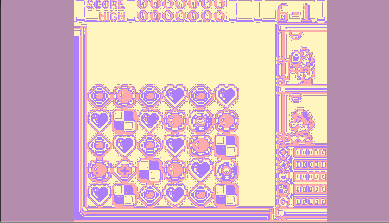
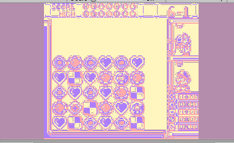

# unity_shader_fun
Learning shaders with awesome Leon Denise exercices (https://github.com/leon196/SIGExam) and other personal experiments

Palette swap shader :

Swap between two palettes

Swap between palette and grayscale version
